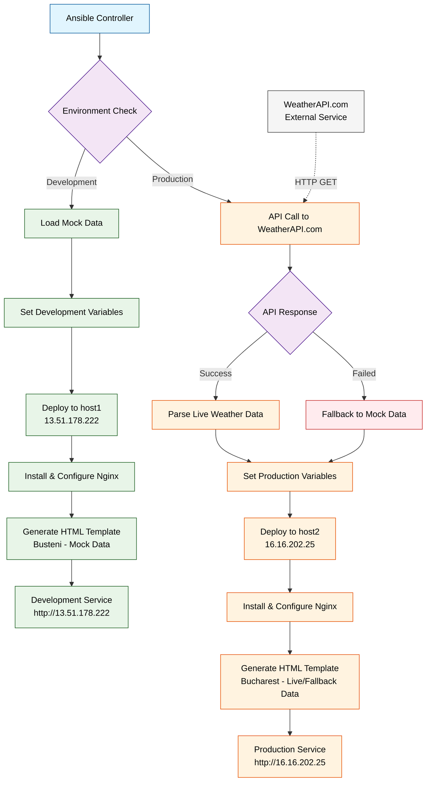

# Weather App with Environment-Specific Templates

## Overview
This lab demonstrates environment-specific template deployment using Ansible. We'll create a weather application that shows mock data in development (Busteni) and real data in production (Bucharest).

## Duration: 45 minutes

## Learning Objectives
- Create environment-specific inventories
- Use conditional templating based on environment
- Deploy different configurations for dev/prod
- Integrate with external APIs conditionally

## Lab Setup

### Create Project Directory
```bash
mkdir weather-app-lab
cd weather-app-lab
mkdir templates
```

### Create Environment-Specific Inventory

Create `hosts.yml`:

```yaml
all:
  hosts:
    localhost:
      ansible_connection: local
    host1:
      ansible_host: 13.51.178.222
      ansible_user: ubuntu
    host2:
      ansible_host: 16.16.202.25
      ansible_user: ubuntu
  vars:
    ansible_user: ubuntu
    ansible_ssh_pass: LetMe1n!
    ansible_ssh_private_key_file: ~/.ssh/ansible_key
    ansible_python_interpreter: /usr/bin/python3
    ansible_ssh_common_args: "-o StrictHostKeyChecking=no -o UserKnownHostsFile=/dev/null"
  children:
    # Development Environment
    development:
      hosts:
        host1:
          city_name: "Busteni"
          weather_data:
            temperature: 18
            condition: "Mountain Fresh"
            humidity: 75
            wind_speed: 2.5
            description: "Cool mountain air with light breeze"
            pressure: 1020
            visibility: 15
      vars:
        environment: development
        server_role: "web"
        environment_type: "dev"
        app_color: "#e8f4f8"
    
    # Production Environment  
    production:
      hosts:
        host2:
          city_name: "Bucharest"
      vars:
        environment: production
        server_role: "web"
        environment_type: "prod"
        weather_api_key: "c0ac323c4eed4a889f272444253009"
        weather_api_url: "https://api.weatherapi.com/v1/current.json"
    
    # Group all web servers
    webservers:
      children:
        development:
        production:
```

### Create Weather App Template

Create `templates/weather-app.html.j2`:

```html
<!DOCTYPE html>
<html>
<head>
    <title>Weather Service - {{ city_name }}</title>
</head>
<body>
    <h1>Weather Service</h1>
    <h2>{{ city_name }} - {{ group_names[0] | upper | default('UNKNOWN') }}</h2>
    
    
    <!-- Development: Mock Data -->
    <p><strong>Temperature:</strong> {{ weather_data.temperature }}°C</p>
    <p><strong>Condition:</strong> {{ weather_data.condition }}</p>
    <p><strong>Humidity:</strong> {{ weather_data.humidity }}%</p>
    <p><strong>Wind:</strong> {{ weather_data.wind_speed }} m/s</p>
    <p><em>{{ weather_data.description }}</em></p>
    <p><small>[MOCK DATA for development]</small></p>
    
    
    <!-- Production: API Data or Mock Fallback -->
    <p><strong>Temperature:</strong> {{ weather_api_data.temperature }}°C</p>
    <p><strong>Condition:</strong> {{ weather_api_data.condition }}</p>
    <p><strong>Humidity:</strong> {{ weather_api_data.humidity }}%</p>
    <p><strong>Wind:</strong> {{ weather_api_data.wind_speed }} m/s</p>
    <p><em>{{ weather_api_data.description }}</em></p>
    
    <p><small>[MOCK DATA - API key invalid, switched to fallback]</small></p>
    
    <p><small>[LIVE DATA from WeatherAPI.com]</small></p>
    
    
    
    <hr>
    <h3>Server Info</h3>
    <p><strong>Hostname:</strong> {{ ansible_hostname }}</p>
    <p><strong>IP:</strong> {{ ansible_default_ipv4.address }}</p>
    <p><strong>OS:</strong> {{ ansible_distribution }} {{ ansible_distribution_version }}</p>
    <p><strong>Environment:</strong> {{ group_names[0] | default('unknown') }}</p>
    
    <hr>
    <p><em>Generated: {{ ansible_date_time.iso8601 }}</em></p>
</body>
</html>
```

### Create Deployment Playbook

Create `deploy-weather-app.yml`:

```yaml
---
- name: Deploy Weather App with Environment-Specific Configuration
  hosts: webservers
  become: yes
  vars:
    app_name: "Weather Service"
    app_version: "1.0.0"
    
  tasks:
    - name: Debug environment variables
      debug:
        msg: |
          Environment: {{ environment | default('NOT_SET') }}
          City: {{ city_name | default('NOT_SET') }}
          Group Names: {{ group_names }}
          Host: {{ inventory_hostname }}
    
    - name: Install required packages
      package:
        name: 
          - nginx
          - curl
        state: present
        
    - name: Start and enable NGINX
      service:
        name: nginx
        state: started
        enabled: yes
    
    - name: Handle weather data for production
      block:
        - name: Fetch real weather data from API
          uri:
            url: "{{ weather_api_url }}?key={{ weather_api_key }}&q={{ city_name }}&aqi=no"
            method: GET
            return_content: yes
          register: weather_response
          
        - name: Parse successful API response
          set_fact:
            weather_api_data:
              temperature: "{{ weather_response.json.current.temp_c | round(1) }}"
              condition: "{{ weather_response.json.current.condition.text }}"
              humidity: "{{ weather_response.json.current.humidity }}"
              wind_speed: "{{ weather_response.json.current.wind_kph | float / 3.6 | round(1) }}"
              description: "{{ weather_response.json.current.condition.text }}"
              
      rescue:
        - name: API call failed - switching to mock data for production
          debug:
            msg: "API call failed (invalid key or network error). Using mock data for production environment."
            
        - name: Set mock weather data for production (API fallback)
          set_fact:
            weather_api_data:
              temperature: "24"
              condition: "Clear Sky"
              humidity: "58"
              wind_speed: "2.8"
              description: "Mock data (API key invalid)"
              
      when: "'production' in group_names"
        
    - name: Deploy environment-specific weather app
      template:
        src: weather-app.html.j2
        dest: /var/www/html/index.html
        owner: www-data
        group: www-data
        mode: '0644'
        backup: yes
      register: app_deploy
      
    - name: Display deployment summary
      debug:
        msg: |
          =================================
          Weather Service Deployment
          =================================
          Environment: {{ environment | default(group_names[0] | default('unknown')) }}
          City: {{ city_name }}
          Server: {{ ansible_hostname }}
          IP: {{ ansible_default_ipv4.address }}
          App URL: http://{{ ansible_host }}
          Weather Data: Mock Fallback ({{ weather_api_data.condition }})Live API ({{ weather_api_data.condition }})Mock ({{ weather_data.condition }})Unknown
          Template Changed: {{ app_deploy.changed }}
          =================================
```

## Lab Exercises

### Exercise 1: Deploy to Development Environment

```bash
# Deploy to development (Busteni with mock data)
ansible-playbook -i hosts.yml deploy-weather-app.yml --limit development

# Check the result
curl http://13.51.178.222/
```

**Expected Result:**
- Mock weather data for Busteni
- Simple HTML without CSS styling
- Mountain weather conditions (18°C, Mountain Fresh)
- "[MOCK DATA for development]" indicator

### Exercise 2: Deploy to Production Environment

```bash
# Deploy to production (Bucharest with real API data)
ansible-playbook -i hosts.yml deploy-weather-app.yml --limit production

# Check the result
curl http://16.16.202.25/
```

**Expected Result:**
- Real weather data for Bucharest from WeatherAPI.com
- Simple HTML without CSS styling
- Live weather conditions (temperature varies)
- "[LIVE DATA from WeatherAPI.com]" indicator

### Exercise 3: Deploy to Both Environments

```bash
# Deploy to all environments
ansible-playbook -i hosts.yml deploy-weather-app.yml

# Compare the results
echo "=== Development (Busteni - Mock Data) ==="
curl -s http://13.51.178.222/ | grep -E "(Temperature|Condition|MOCK)"

echo "=== Production (Bucharest - Live API) ==="
curl -s http://16.16.202.25/ | grep -E "(Temperature|Condition|LIVE)"
```

### Exercise 4: Verify API Integration

```bash
# Check development server (mock data)
echo "Development Environment:"
echo "- City: Busteni"
echo "- Data Source: Mock/Static values"
echo "- Weather: 18°C, Mountain Fresh"

# Check production server (live API)
echo "Production Environment:"
echo "- City: Bucharest"
echo "- Data Source: WeatherAPI.com"
echo "- Weather: Live data (varies)"

# Test API call manually (correct format)
curl -s "https://api.weatherapi.com/v1/current.json?key=c0ac323c4eed4a889f272444253009&q=Bucharest&aqi=no" | python3 -m json.tool
```

## Environment Comparison

| Aspect | Development (host1: 13.51.178.222) | Production (host2: 16.16.202.25) |
|--------|-------------------------------------|-----------------------------------|
| City | Busteni | Bucharest |
| Weather Data | Mock (18°C, Mountain Fresh) | Live API (WeatherAPI.com) |
| Data Source | Static variables in inventory | Real-time API call during deployment |
| API Token | Not used | c0ac323c4eed4a889f272444253009 |
| Template | Simple HTML, no CSS | Simple HTML, no CSS |
| Data Freshness | Static at deployment time | Live at deployment time |
| Dependencies | None | Internet connection + API |

## Key Learning Points

1. **Environment-Specific Variables**: Different inventory groups can have different variables and API configurations
2. **Conditional Templating**: Use `` statements to render different content based on environment
3. **API Integration**: Use `uri` module to fetch real-time data from external APIs during deployment
4. **Conditional Task Execution**: Tasks can run only on specific environments (`when: environment == 'production'`)
5. **Data Parsing**: Use `set_fact` to parse JSON responses and create structured data
6. **Template Simplicity**: Simple HTML templates without CSS for better maintainability
7. **Real vs Mock Data**: Development uses static mock data, production fetches live API data
8. **API Call Methods**: WeatherAPI.com uses query parameters, not form data in request body
9. **Error Handling**: Block/rescue pattern provides graceful fallback when external APIs fail

## API Integration Benefits

- **Development**: Fast deployment with predictable mock data
- **Production**: Real-time weather data ensures accuracy
- **Template Reusability**: Same template works for both environments
- **Deployment-Time Data**: Fresh data fetched during each deployment

## Troubleshooting

### API Key Issues

If you see "API ERROR - Using fallback data" in production:

1. **Check API Key**: The current key `c0ac323c4eed4a889f272444253009` may be expired
2. **Get New Key**: Visit https://www.weatherapi.com/ to get a free API key
3. **Update Inventory**: Replace `weather_api_key` in the production group vars
4. **Test Manually**:
   ```bash
   # Correct WeatherAPI.com format - parameters as query string
   curl "https://api.weatherapi.com/v1/current.json?key=YOUR_NEW_KEY&q=Bucharest&aqi=no"
   ```

### Error Handling with Block/Rescue

The playbook uses Ansible's `block/rescue` structure that:
- **Block**: Attempts to fetch real weather data from API
- **Rescue**: If API fails (invalid key, network error), automatically switches to mock data
- **Graceful Degradation**: Production continues with mock data instead of failing
- **Clear Indicators**: Web page shows "[MOCK DATA - API key invalid, switched to fallback]"
- **Educational Value**: Demonstrates proper error handling patterns in Ansible

### Block/Rescue Structure
```yaml
- name: Handle weather data for production
  block:
    - name: Fetch real weather data from API
      # Try to get real data
  rescue:
    - name: Set mock weather data for production (API fallback)
      # Use mock data if API fails
  when: "'production' in group_names"
```

## Architecture Overview

The following diagram illustrates the complete weather service deployment flow:



### Flow Explanation:

1. **Ansible Controller** initiates the deployment process
2. **Environment Check** determines whether target is development or production
3. **Development Path** (green) loads static mock data for Busteni
4. **Production Path** (orange) attempts live API call to WeatherAPI.com
5. **Error Handling** (red) provides fallback to mock data if API fails
6. **Infrastructure Setup** installs and configures Nginx on target hosts
7. **Template Generation** creates environment-specific HTML content
8. **Final Services** deliver two functional web endpoints with different data sources

### Color Legend:
- **Blue**: Ansible Controller and orchestration
- **Green**: Development environment processes
- **Orange**: Production environment processes
- **Purple**: Decision points and conditional logic
- **Red**: Error handling and fallback mechanisms
- **Gray**: External services and dependencies

## Conclusion

This lab demonstrates a practical approach to environment-specific deployments where development uses mock data for speed and predictability, while production integrates with real APIs for accurate, live data. The error handling ensures the deployment succeeds even when external dependencies fail, which is crucial for production automation.
